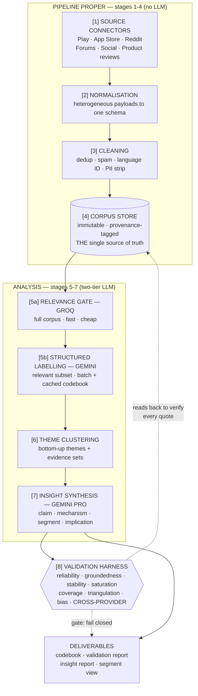

# Architecture — AI-Powered Discovery Engine

**Project:** NextLeap Grad Project — Review Analyser
**Subject:** Blinkit (Indian quick commerce) — category exploration barriers
**Role:** Product Manager, Growth Team
**Phase:** Part 1 — Discovery Engine
**Date:** 27 July 2026
**Status:** Design v2 — build spec
**LLM stack:** Groq + Google Gemini (two-provider design — see §9)

> Companion documents: [PROBLEM_STATEMENT.md](PROBLEM_STATEMENT.md) (why) · [context.md](context.md) (condensed reference).
> This document is the **how**. Every design decision below traces to a requirement in one of those two files;
> where it does, the requirement is cited inline as `[ctx §N]`.
>
> **Changed in v2:** the LLM layer is now specified for **Groq and Gemini**. This is not a
> model-name swap — it changes the batching strategy, the caching strategy, the cost model, and
> the routing design (§9), and it **adds a validation dimension** the single-provider design could
> not offer (§12.8).

---

## 0. How to read this document

Sections 1–3 give the design goals, principles, and system overview. **Section 4 is the most
important section** — it defines the data contracts that every stage reads and writes; get those
wrong and nothing downstream is recoverable. Sections 5–12 specify each pipeline stage in
execution order. Sections 13–16 cover orchestration, repo layout, stack, and cost. Sections 17–19
cover failure modes, compliance, and an end-to-end traceability walkthrough. Section 20 is the
build sequence.

A reader who only has five minutes should read §3 (overview), §4.1 (the Verbatim record), §9.1
(the two-tier LLM routing), and §19 (traceability walkthrough).

---

## 1. Scope and design goals

### 1.1 What this system does

Ingests unstructured public user feedback about Blinkit and its competitors from multiple
heterogeneous sources, normalises it into a single provenance-tagged corpus, applies consistent
LLM-based structured labelling across the whole corpus, induces themes bottom-up, synthesises
those themes into decision-grade insights, and **proves the result is trustworthy** through a
measured validation harness.

### 1.2 What it explicitly does not do

It does not recommend features, design solutions, or size business cases `[ctx §10]`. Its output
is understanding. It also does not touch any internal Blinkit data — this is a public-data
project, and every quantitative behavioural claim it produces is an inference from public
discourse, labelled as such `[ctx §12.5]`.

### 1.3 Design goals, in priority order

| # | Goal | Why it ranks here |
|---|---|---|
| 1 | **Traceability** — every insight walks back to a real, provenance-tagged verbatim | The 100%-quote-verifiability bar is a hard pass/fail `[ctx §8]`. A system that cannot prove its evidence has no output worth reading. |
| 2 | **Corpus quality and breadth** | Insight quality is capped by corpus quality; the *barrier type* we identify is a direct function of which sources we reached `[ctx §7.0]`. |
| 3 | **Repeatability** — re-runnable on new data, not a one-off | Explicit requirement `[ctx §7 "at scale"]`. Also the only way to measure stability `[ctx §8]`. |
| 4 | **Auditability** — every label attributable to a provider, model, prompt version, and codebook version | Required to explain disagreements in the reliability check rather than hide them `[ctx §8]`. |
| 5 | **Cost discipline** | A design that can only be run once cannot be validated for stability. Cheap re-runs are a *correctness* requirement, not a budget preference. |
| 6 | Throughput | Corpus is tens of thousands of documents, not billions. Correctness beats speed at this scale. |

Speed ranks last deliberately. The corpus is small enough that a slow-but-verifiable design costs
hours, while an unverifiable one costs the project's credibility. (Groq happens to make this a
non-issue — see §9.2 — but the priority ordering stands regardless.)

---

## 2. Architectural principles

These are the eight rules the design is accountable to. Each maps to a project standing rule
`[ctx §11]` or validation dimension `[ctx §8]`.

**P1 — Provenance is captured at ingestion, never retrofitted.**
Source, source ID, URL, timestamp, rating, language, and collector version ride with every
verbatim from the moment it enters the system. Provenance cannot be added later `[ctx §7.0]`, so
a connector that drops it has produced unusable data regardless of text quality.

**P2 — The corpus store is immutable and append-only.**
Analysis stages read from it; nothing mutates it. Re-labelling produces a new label set against
the same frozen corpus. This makes stability measurement meaningful — if the corpus shifted
between runs, comparing theme sets would measure nothing.

**P3 — Fail closed on groundedness.**
If a quote cited by a model cannot be located by exact string match in the corpus, the insight is
rejected — not flagged, not softened. Any fabricated quote is a hard failure `[ctx §8]`.

**P4 — Themes are induced before they are applied.**
The codebook is derived from an open-coding pass over a sample, not written in advance and
confirmed `[ctx §11.5]`. See §9.4 — this is the single most contestable methodological choice in
the system, and the design addresses it head-on.

**P5 — Every artifact is versioned and every run is manifested.**
Provider, model ID, codebook version, prompt version, seed, and corpus snapshot ID are recorded
per run. Two runs that disagree must be diagnosable.

**P6 — Competitor data is collected as a first-class citizen.**
Not a nice-to-have. Without it, no finding can be attributed to Blinkit rather than to quick
commerce as a category `[ctx §7.0]`.

**P7 — No PII enters the corpus store.**
Author identifiers are salted-hashed at ingest; emails, phone numbers, and order IDs are stripped
before storage `[ctx §10]`. PII removal happens *before* persistence, not before analysis.

**P8 — The pipeline core is provider-agnostic.** *(new in v2)*
No stage outside `engine/llm/` imports a vendor SDK. Every LLM call goes through one internal
interface (§9.6). This is not architectural purity for its own sake — hosted model catalogues
churn, and a model ID deprecation must be a one-line config change, not a refactor across the
labelling, induction, clustering, and synthesis stages. It is also what makes the cross-provider
validation in §12.8 possible at all.

---

## 3. System overview



Plain-text equivalent for renderers without Mermaid:

```
 [1] CONNECTORS ──▶ [2] NORMALISE ──▶ [3] CLEAN ──▶ [4] CORPUS STORE
                                                          │  (immutable)
                                                          ▼
        [5a] RELEVANCE GATE (Groq)  ──▶  [5b] LABELLING (Gemini)
                                                          │
                                                          ▼
                              [6] CLUSTER ──▶ [7] SYNTHESISE (Gemini Pro)
                                                          │
                                                          ▼
                                                  [8] VALIDATION HARNESS
                                                          │
                                          reads back ─────┘ (verifies every
                                          against [4]        quote exists)
                                                          │
                                                          ▼
                                                     DELIVERABLES
```

**Stages 1–4 are the pipeline proper and contain no LLM calls at all. Stages 5–8 consume the
corpus and are only as good as it is** `[ctx §7.0]`. The dotted line from the validation harness
back to the corpus store is the load-bearing edge: it is what makes groundedness mechanically
checkable instead of a claim.

### 3.1 Execution model

Local-first, file-based, no server. The environment is Windows 11 with Python 3.12.4 `[ctx §1]`,
so the design avoids anything requiring a database daemon, container runtime, or cloud
infrastructure. Every stage is a CLI entry point that reads files and writes files. Both LLM
providers are accessed over plain HTTPS APIs with no local model hosting. This makes the whole
system reproducible by a reviewer on a laptop, which is itself part of the deliverable
`[ctx §9.1]`.

---

## 4. Data contracts

The schemas below are the interface between stages. They are the most important part of this
architecture — a stage can be rewritten freely as long as it honours its contract.

### 4.1 `Verbatim` — the atomic unit

One user-authored text: a review, a post, or a comment. Written by stage 3 and **immutable
thereafter**.

```python
from datetime import datetime
from typing import Literal
from pydantic import BaseModel, Field

class Engagement(BaseModel):
    score: int | None = None          # upvotes / net score, where the source exposes it
    replies: int | None = None
    helpful_votes: int | None = None

class Verbatim(BaseModel):
    # ---- identity ----
    verbatim_id: str                  # sha256(source + source_id)[:16] — deterministic, stable across re-runs
    content_hash: str                 # sha256(normalised text) — exact-duplicate detection
    simhash: int                      # 64-bit — near-duplicate detection

    # ---- provenance (P1: captured at ingest, never retrofitted) ----
    source: Literal["play_store", "app_store", "reddit", "forum",
                    "youtube", "x", "product_review", "news_comment"]
    source_id: str                    # the source's own ID; unique within source
    url: str | None                   # deep link back to the original, where one exists
    brand: Literal["blinkit", "zepto", "instamart", "bigbasket",
                   "flipkart_minutes", "amazon_now", "other", "generic"]
    collected_utc: datetime
    collector_version: str            # e.g. "play_store@1.2.0" — which code produced this
    raw_payload_ref: str              # pointer into the raw archive: "{run_id}/{source}.jsonl.gz#L1234"

    # ---- content ----
    text_raw: str                     # exactly as collected, post-PII-strip. NEVER edited again.
    text_clean: str                   # whitespace-normalised; used for hashing and matching
    char_count: int

    # ---- attributes ----
    created_utc: datetime | None      # when the user wrote it (null where source hides it)
    rating: float | None              # 1-5 where applicable
    rating_scale: int | None          # 5 for stores; null for Reddit/forums
    lang: str                         # ISO 639-1: en, hi, ...
    lang_confidence: float
    is_romanised: bool                # Hinglish / romanised Indic — drives model routing (§9.3)
    app_version: str | None           # Play Store exposes this; useful for time-anchoring complaints
    geo_hint: str | None              # city/region IF the source states it. Never inferred.

    # ---- threading (Reddit / YouTube / forums) ----
    thread_id: str | None
    parent_id: str | None
    depth: int = 0

    # ---- privacy (P7) ----
    author_hash: str | None           # HMAC-SHA256(author, project_salt). Irreversible. For
                                      # dedup and "same user posted N times" only.
    engagement: Engagement = Field(default_factory=Engagement)
```

**Design notes:**

- `verbatim_id` is a **deterministic hash of source + source_id**, not a UUID. Re-running the
  collector on overlapping data produces identical IDs, which makes incremental collection
  idempotent (P5) and lets us diff corpus snapshots meaningfully.
- `text_raw` is frozen after PII stripping. All matching happens against `text_clean`, but
  **quotes in deliverables are drawn from `text_raw`** so what a reviewer sees is what the user
  actually wrote.
- `is_romanised` is a schema field, not a preprocessing detail — and in v2 it is **load-bearing
  for routing**. A large share of Indian user feedback is Hinglish in Latin script, and model
  families differ sharply in how well they handle it (§9.3).
- `geo_hint` is populated **only** when the source states it. We never infer location from
  language or content.
- `brand` includes `"generic"` for q-commerce discussion naming no specific player.

### 4.2 `Label` — structured coding of one verbatim

Written by stage 5. **Many labels may exist per verbatim** (one per run, and in the validation
sample one per provider), which is what makes both stability (§12.3) and cross-provider agreement
(§12.8) measurable.

```python
class EvidenceSpan(BaseModel):
    quote: str                        # verbatim substring, model-extracted
    start: int | None = None          # RECOMPUTED by us, never trusted from the model — see §9.7
    end: int | None = None

class Label(BaseModel):
    # ---- run identity (P5) ----
    label_id: str
    verbatim_id: str                  # FK to Verbatim
    run_id: str
    codebook_version: str
    prompt_version: str
    provider: Literal["groq", "gemini"]      # v2: which vendor produced this
    model: str                               # exact model ID as configured
    tier: Literal["gate", "label", "adjudicate"]

    # ---- relevance gate ----
    is_relevant: bool                 # does this bear on category exploration at all?
    relevance_reason: str | None

    # ---- the coding ----
    barriers: list[str]               # codebook barrier codes
    barrier_types: list[Literal["awareness", "trust", "price", "information",
                                "friction", "habit", "external_loyalty"]]
    drivers: list[str]                # what made someone try something new
    discovery_paths: list[str]        # how they found it
    categories_mentioned: list[str]   # L1 nodes
    info_needs: list[str]             # what they needed to know before trying
    unmet_needs: list[str]

    # ---- segment signals (inferred from text only, never from identity) ----
    segment_signals: dict[str, str]   # e.g. {"household": "has_pet", "tenure": "new_user"}
    competitor_mentions: list[str]

    # ---- affect ----
    sentiment: Literal["positive", "neutral", "negative", "mixed"]
    intensity: int                    # 1-5

    # ---- grounding (P3) ----
    evidence_spans: list[EvidenceSpan]
    confidence: float                 # model's own, calibration-checked in §12
```

The `barrier_types` enum is the seven-way classification the Definition of Done requires
`[ctx §9]`. It is fixed; the free-text `barriers` codes beneath it are induced from data (§9.4).
This split is intentional — the *taxonomy of barrier kinds* is a stable analytical frame, while
the *specific barriers* must be discovered.

`provider` and `tier` are new in v2 and are not bookkeeping: without them, a disagreement between
two labels of the same verbatim is uninterpretable, and §12.8 cannot be computed.

### 4.3 `Theme` — a cluster with an evidence set

```python
class Theme(BaseModel):
    theme_id: str
    run_id: str
    name: str                         # short, human-readable
    definition: str                   # codebook-grade: what counts and what does not
    barrier_type: str | None
    verbatim_ids: list[str]           # the full evidence set — not a sample
    mention_count: int
    source_distribution: dict[str, int]   # {"reddit": 41, "play_store": 118, ...}
    brand_distribution: dict[str, int]    # blinkit vs competitors — drives attribution
    segment_distribution: dict[str, int]
    exemplar_quotes: list[EvidenceSpan]
    first_seen_at_doc_n: int          # feeds the saturation curve (§12.4)
```

`brand_distribution` is what turns a theme into an attributable finding: high Blinkit *and* high
Zepto counts means a category problem; Blinkit-only means ours `[ctx §7.0]`.

### 4.4 `Insight` — the deliverable unit

The shape the brief demands: frequency alone is not an insight `[ctx §7]`.

```python
class Insight(BaseModel):
    insight_id: str
    run_id: str
    research_question: int            # 1-8, maps to [ctx §7 research questions]

    claim: str                        # what is true
    mechanism: str                    # WHY it is true — the causal story
    affected_segment: str             # WHO it applies to
    implication: str                  # what it means for the goal (NOT a solution)

    supporting_theme_ids: list[str]
    evidence_volume: int              # number of distinct verbatims behind it
    sources_triangulated: list[str]   # ≥2 required for "high" confidence
    brand_attribution: Literal["blinkit_specific", "category_wide", "unclear"]

    confidence: Literal["high", "medium", "low"]
    known_bias: str                   # WITH DIRECTION STATED — see §12.7
    contradicting_evidence: str | None   # counter-evidence, surfaced not buried
```

Two fields exist purely to enforce project rules: `known_bias` (insights carry their uncertainty,
with direction stated `[ctx §8]`) and `contradicting_evidence` (report the bad results too
`[ctx §11.4]`). Making them **required schema fields** rather than optional prose is how the
design prevents them from being quietly skipped under time pressure.

---

## 5. Stage 1 — Source connectors

### 5.1 Connector interface

```python
class Connector(Protocol):
    name: str
    version: str

    def collect(self,
                query: SourceQuery,
                since: datetime | None,      # incremental watermark
                limit: int | None) -> Iterator[RawRecord]: ...
```

Connectors emit `RawRecord` and **write the raw payload to the archive before normalisation**.
The raw archive is what makes `raw_payload_ref` resolvable and lets us re-normalise without
re-collecting — important when a schema bug is found after a week-long collection run.

### 5.2 Per-source specification

| Source | Access method | Volume expectation | Provenance available | Key risk |
|---|---|---|---|---|
| **Google Play** | `google-play-scraper` (`reviews()` with continuation token) | **Highest** — the volume backbone | rating, timestamp, app version, thumbs-up, reply | Rate limiting; must paginate politely with backoff |
| **Apple App Store** | Public RSS review feed, JSON, per-storefront, paginated | Low (feed depth is capped) | rating, timestamp, app version, title | Shallow history — a snapshot, not an archive. Collect on a schedule to accumulate. |
| **Reddit** | PRAW (official API, OAuth app credentials) | Medium volume, **highest value per document** | score, timestamp, subreddit, thread structure | Requires API credentials; must traverse comment trees (`replace_more`), not just top posts |
| **Forums / complaint sites** | HTTP + HTML parsing, robots.txt-respecting | Low–medium | timestamp, thread, resolution status | Fragile selectors; heavily negative-skewed — must be weighted, see §12.7 |
| **YouTube comments** | YouTube Data API v3 `commentThreads` | Medium | likes, timestamp, video context | Quota-limited; comment spam is severe |
| **X / Twitter** | Official API tier | **Constrained** | engagement, timestamp | Access is cost-gated. **Treat as best-effort; declare honestly if thin.** |
| **Instagram comments** | No compliant public API path | **Likely zero** | — | **Document as a known gap rather than scraping around it** (§18) |
| **Product reviews** | Category-level review text where publicly exposed | Medium | rating, category, product | Highest direct value for research question 5 |
| **News / newsletter comments** | HTTP + parsing | Low | timestamp | Context only, not primary evidence |

**On the constrained rows:** X and Instagram are named in the brief as desirable sources. Where
access is genuinely constrained, the correct engineering answer is to **collect what is
accessible, state the gap plainly in the corpus documentation, and carry the resulting bias into
every affected insight** — not to quietly substitute another source and imply full coverage. This
is standing rule 4 applied to data collection `[ctx §11.4]`.

### 5.3 Target configuration

Identifiers live in **one config file**, never inline in code:

```yaml
# config/sources.yaml
brands:
  blinkit:
    play_package:   "com.grofers.customerapp"      # [VERIFY before first run]
    app_store_id:   "<blinkit_ios_id>"             # [VERIFY]
  zepto:
    play_package:   "com.zeptoconsumerapp"         # [VERIFY]
  instamart:
    play_package:   "in.swiggy.android"            # [VERIFY] — Instamart rides inside Swiggy;
                                                   # reviews need category filtering downstream
  bigbasket:
    play_package:   "com.bigbasket.mobileapp"      # [VERIFY]

reddit:
  subreddits: [india, bangalore, mumbai, delhi, hyderabad, pune,
               personalfinanceindia, IndiaSpeaks]
  queries:    ["blinkit", "zepto", "instamart", "quick commerce",
               "10 minute delivery", "grocery delivery"]

collection:
  locale: { lang: "en", country: "in" }
  window: { since: "2024-01-01", until: null }
  politeness: { requests_per_minute: 20, backoff: "exponential", max_retries: 5 }
```

Every identifier is marked `[VERIFY]`. Standing rule 1 — no invented numbers `[ctx §11.1]` —
applies to identifiers as much as to statistics: an unverified package name silently collects the
wrong app's reviews and poisons the entire corpus. A `make verify-sources` target resolves each
identifier and fails loudly on mismatch **before** any collection run begins.

**Swiggy Instamart needs special handling:** it has no standalone app — its reviews are mixed into
Swiggy's app reviews alongside food delivery. Instamart verbatims must be isolated by content
filtering downstream, and the residual contamination rate reported as a known corpus limitation.

### 5.4 Collection strategy

- **Stratified, not convenience, sampling.** Play Store reviews must be drawn across *all* rating
  bands `[ctx §7 sources]`. Collecting only 1-star reviews would guarantee finding that the
  barrier is friction — precisely the failure mode §7.0 warns about.
- **Per-source collection quotas — collect to a planned composition.** Each `(source, brand)` has a
  target volume band in config, not an unbounded "take everything available". Play Store will
  happily yield 30k reviews while Reddit yields 800; letting that ratio stand means the corpus is
  dominated by short store reviews and thin on the long-form reasoning that actually answers the
  research questions `[ctx §7.0]`. Quotas are also the **upstream mitigation for LLM token limits**:
  if a budget shortfall later forces sampling (§16.6), the sample inherits the corpus composition —
  so the composition has to be right at collection time. Under-filled quotas are reported, never
  silently backfilled from an easier source.
- **Incremental with watermarks.** Each `(source, brand)` pair stores a high-water mark.
  Deterministic `verbatim_id`s make re-collection overlap harmless.
- **Politeness by default.** Rate limits, exponential backoff, honest user agent, robots.txt
  respected (§18).
- **Raw-first.** Write the raw payload before parsing it.

---

## 6. Stage 2 — Normalisation

Maps each source's payload into the `Verbatim` schema. Pure functions, one per source, unit-tested
against saved fixture payloads.

1. **Field mapping** — source-specific keys into canonical names.
2. **Timestamp normalisation** — everything to UTC. Sources report local time, epoch seconds, and
   ISO strings inconsistently; a mixed-timezone corpus makes temporal analysis (research question
   4, habit calcification) meaningless.
3. **Rating normalisation** — common scale with `rating_scale` recorded, so a 5-star store rating
   is never silently compared against a Reddit upvote count.
4. **Threading** — `thread_id` / `parent_id` / `depth`. A Reddit reply loses most of its meaning
   without its parent.
5. **Brand tagging** — from the collection target, plus content-based tagging for generic
   discussion mentioning multiple brands.

**Invariant:** normalisation is a *total* function — an unmappable payload goes to quarantine with
a reason, never silently dropped. Silent drops are how corpora acquire invisible bias.

---

## 7. Stage 3 — Cleaning

Four sub-stages, in order. PII stripping must precede persistence (P7); dedup must precede
language ID (no point classifying duplicates).

### 7.1 PII stripping (runs first)

Regex + heuristic removal of emails, phone numbers, order IDs, and delivery addresses, replaced
with typed placeholders (`<EMAIL>`, `<PHONE>`, `<ORDER_ID>`) rather than deleted — deletion
corrupts sentence structure and degrades downstream labelling. Author names are HMAC-hashed with
a project salt; the salt is never committed. This runs **before** anything is written to disk
`[ctx §10]`.

### 7.2 Deduplication

| Pass | Method | Catches |
|---|---|---|
| **Exact** | `content_hash` equality | Cross-posts, re-collection overlap, identical review text |
| **Near** | 64-bit SimHash, Hamming distance ≤ 3 | Templated/bot reviews, minor edits, copy-paste variants |

Near-duplicate clusters are **collapsed to one representative with `duplicate_count` retained**,
not deleted. If 400 near-identical reviews complain about the same thing, that is real signal
about volume — but counting them as 400 independent pieces of evidence would badly inflate a
theme's apparent support and corrupt the frequency numbers the insight report depends on. Keeping
the count while collapsing the evidence preserves both facts.

### 7.3 Spam and bot filtering

Cheapest filter first:

1. **Heuristics** — length floor, URL density, emoji-only, repeated-character runs, promo-code
   patterns, identical text from many `author_hash` values.
2. **Engagement signal** — zero-engagement duplicated text is a strong bot tell.
3. **LLM relevance gate** — stage 5a (§9.2) acts as the final semantic filter.

Filtered records go to quarantine with the reason recorded, and the filter rate per source is
**reported in the corpus documentation**. A spam filter with no reported false-positive inspection
is itself an unvalidated component.

### 7.4 Language identification

Three-way: `en`, Indic-script (`hi`, `bn`, `ta`, …), and **romanised/Hinglish**.

The third case is the hard one. Off-the-shelf detectors confidently label Hinglish as English, so
the pipeline uses a lexicon-plus-script heuristic to set `is_romanised`, and low-confidence cases
are resolved during labelling. Analysis runs on original text — **no machine translation**, since
translating *sasta* to *cheap* loses the connotation that distinguishes a price barrier from a
quality-perception barrier.

In v2 this field does more than describe: `is_romanised` **routes the verbatim to a specific
model** (§9.3), because model families differ materially in Hinglish competence.

---

## 8. Stage 4 — Corpus store

**The single source of truth. Immutable, append-only (P2).**

### 8.1 Layout

```
data/
├── raw/                                   # untouched payloads, gzipped JSONL
│   └── {run_id}/{source}_{brand}.jsonl.gz
├── corpus/                                # THE corpus — partitioned Parquet
│   └── snapshot_id={snapshot}/
│       └── source={source}/brand={brand}/part-0000.parquet
├── quarantine/
│   ├── unparseable/{run_id}.jsonl         # normalisation failures + reason
│   └── filtered/{run_id}.jsonl            # spam/dup removals + reason
├── labels/{run_id}/labels.parquet
├── themes/{run_id}/themes.json
├── insights/{run_id}/insights.json
└── manifests/{run_id}.json                # full run provenance
```

### 8.2 Why Parquet + DuckDB

- **Columnar** — the validation harness repeatedly scans single columns (source, brand, rating,
  language) across the whole corpus. Row storage would make §12 slow enough to discourage running
  it, and a validation step that is annoying to run stops being run.
- **DuckDB queries Parquet in-process** — no server, works on the Windows/Anaconda environment
  `[ctx §1]` with a `pip install`.
- **Portable** — a reviewer can open the corpus with pandas alone.

### 8.3 Snapshot discipline

A **snapshot ID** freezes the corpus for an analysis run. Labelling, clustering, synthesis, and
validation for a given `run_id` all read the same snapshot. Adding data creates a new snapshot; it
never modifies an existing one. Without this, the stability check (§12.3) would compare runs over
different data and measure nothing.

---

## 9. Stage 5 — Labelling *(rewritten for the Groq + Gemini stack)*

The first LLM stage. Converts unstructured text into the `Label` schema (§4.2), consistently,
across the entire corpus.

### 9.1 Provider strategy — why two, and what each is for

Groq and Gemini are not redundant options where one is a fallback for the other. They have
**different and complementary shapes**, and the design assigns each the work it is actually good
at:

| | **Groq** | **Gemini** |
|---|---|---|
| Core strength | Extreme inference speed on open-weight models at very low cost per token | Strong multilingual reasoning; very large context; native structured output |
| Best fit here | **High-volume mechanical passes** over the full corpus | **Nuanced structured labelling** and synthesis |
| Structured output | JSON mode / JSON-schema response format (support varies by model — verify per model) | `response_schema` accepts a **Pydantic model directly** — the schema in §4.2 *is* the contract |
| Batch processing | Batch endpoint available — verify current discount and turnaround at build time | Batch mode with a substantial discount and asynchronous turnaround |
| Context caching | Not equivalent to an explicit caching API — do not design around it | Explicit context caching for repeated prefixes, plus implicit caching on recent models |
| Context window | Moderate — constrains how many verbatims fit per request | Very large — the full codebook plus a large verbatim chunk fits comfortably |
| Indic / Hinglish | Varies sharply by model; open-weight models are weaker here | Materially stronger on Indian-language and code-mixed text |
| Main operational risk | **Model catalogue churn** — IDs are added and retired frequently | Batch turnaround latency; quota tiers |

Two consequences drive the design:

1. **Groq's speed and price make a full-corpus pre-pass essentially free**, which the
   single-provider design could not justify. So we add one (§9.2) — it removes irrelevant
   documents before the expensive labelling stage ever sees them.
2. **Gemini's Pydantic-native `response_schema` collapses a whole class of parsing failures.**
   The `Label` model in §4.2 can be passed directly as the response schema rather than
   hand-maintained as a separate JSON Schema string that drifts from the Pydantic class.

### 9.2 Tier 1 — the relevance gate (Groq, full corpus)

A large fraction of collected verbatims will be about delivery times, app crashes, refunds, and
coupon complaints — real feedback, but not evidence about category exploration. Paying a
high-capability model to read all of it is waste.

```
FULL CORPUS (~40k verbatims)
        │
        ▼   GROQ · small fast model · minimal output schema
   ┌─────────────────────────────────────────────┐
   │ is_relevant: bool                           │
   │ relevance_reason: str (≤10 words)           │
   │ primary_topic: enum                         │
   └─────────────────────────────────────────────┘
        │
        ├──▶ NOT RELEVANT → retained in corpus, excluded from Tier 2
        │                    (counted, never deleted — feeds §12.5 coverage)
        ▼
   RELEVANT SUBSET (~30-50% expected) → Tier 2
```

Two design constraints on this gate:

- **The output schema is deliberately tiny.** Output tokens dominate LLM cost (§16), and this pass
  runs over every document in the corpus. A verbose gate would cost more than the labelling it is
  meant to protect.
- **The gate is tuned for recall, not precision.** A false negative here is unrecoverable — the
  document never reaches labelling and its evidence is lost silently. A false positive merely
  costs one extra Tier-2 call. So the prompt is instructed to keep anything plausibly related, and
  **the gate's own false-negative rate is measured** on a hand-checked sample as part of §12.
  An unmeasured filter sitting in front of the entire analysis is exactly the kind of invisible
  corpus-shaping the project's bias requirements exist to prevent.

### 9.3 Tier 2 — structured labelling (Gemini, relevant subset)

Full `Label` extraction against the induced codebook. Routing within this tier:

| Verbatim characteristic | Routed to | Why |
|---|---|---|
| `is_romanised = true` or `lang != "en"` | **Gemini** (higher-capability tier) | Code-mixed Hinglish carries connotation that weaker models flatten — and mishandling it would systematically degrade a large corpus slice rather than a random one |
| Long-form (Reddit posts, detailed reviews) | **Gemini** | Multi-barrier reasoning needs the stronger model; these are also the highest-value documents `[ctx §7 sources]` |
| Short English store reviews | **Gemini standard tier** (Groq optionally, if benchmarked equivalent) | Bulk volume; simplest documents |

The last row is deliberately conditional. **Routing bulk labelling to Groq is only permitted if it
is first benchmarked as equivalent on a held-out sample** — and §12.8 gives us exactly the
mechanism to test that. Assuming equivalence without measuring it would be an unvalidated
cost optimisation sitting underneath every downstream finding.

### 9.4 Codebook induction — two passes (P4)

This addresses the sharpest methodological risk in the project. The brief requires themes to
emerge **bottom-up**, not confirm a pre-written list `[ctx §11.5]`. But labelling needs a codebook
to label *against*. Resolving that circularity naively — writing a codebook from intuition and
applying it — would produce exactly the failure the rule forbids.

```
PASS A — OPEN CODING (inductive, no predefined codes)   ← GEMINI PRO tier
   Stratified random sample (~600-800 verbatims, spread across
   source × brand × rating × language)
        │
        ▼  LLM extracts barriers/drivers/needs in FREE TEXT
   Raw extraction set (unconstrained vocabulary)
        │
        ▼  semantic clustering + human review
   CODEBOOK v1  — codes with names, definitions, inclusion/exclusion
                  rules, and exemplar verbatims
        │
PASS B — AXIAL CODING (deductive, applies CODEBOOK v1)  ← §9.3 routing
        ▼
   Full labelling of the relevant subset against the induced codebook
        │
        ▼  residue check: verbatims matching NO code
   If residue is high → codebook is incomplete → revise to v2, re-run
```

Two properties make this defensible: the vocabulary in Pass A is **unconstrained** (the model is
never shown a candidate barrier list), and the **residue check in Pass B is a falsification test** —
a high proportion of unlabellable verbatims proves the codebook missed something real and forces
revision rather than allowing the analysis to quietly discard inconvenient data. Codebook
evolution across versions is recorded and reported `[ctx §7]`.

Pass A runs on the **highest-capability Gemini tier available** — it is low-volume (hundreds of
documents, once) and disproportionately high-stakes, since every downstream label inherits its
vocabulary. This is the wrong place to economise.

The only pre-fixed element is the seven-way `barrier_types` frame (§4.2), which is an analytical
lens carried from the problem statement, not a findings list — and it is declared as such rather
than presented as a discovery.

### 9.5 Request construction and caching

Verbatims are **batched N-per-request** rather than one per request, amortising the codebook
prefix across many documents.

```
┌─────────────────────────────────────────┐
│ STABLE PREFIX  (cached where supported) │
│  · task definition                      │  ← Gemini: explicit context cache
│  · codebook v{N}: codes + definitions   │     Groq: no equivalent — do not
│  · labelling rules + edge cases         │     design around caching there
├─────────────────────────────────────────┤
│ VOLATILE (never cached)                 │
│  · verbatim 1 [id, source, rating, lang]│
│  · verbatim 2 ...                       │
│  · ... verbatim N                       │
└─────────────────────────────────────────┘
```

Provider-specific handling:

- **Gemini:** create an explicit context cache holding the codebook prefix, reuse its handle
  across all labelling requests for a run, and let it expire with a TTL matched to the run
  duration. Context caches have a **minimum token threshold** — verify the current floor for the
  chosen model and confirm the codebook prefix exceeds it, or the cache is silently a no-op.
- **Groq:** assume no caching benefit. Keep the gate prompt short so the un-amortised prefix cost
  stays negligible. Do not build cost projections that assume caching here.

Chunk size is bounded by the smaller of: the model's context window, output token limits, and the
observed truncation rate. Gemini's large window permits generous chunks; Groq's is the binding
constraint on Tier 1, so Tier 1 chunks are sized separately.

**Caching correctness is asserted, not assumed.** Where a provider reports cached-token usage, the
pipeline logs it and **fails the run if it is zero after the first batch** — a silently-broken
cache is a large invisible cost increase rather than an error.

### 9.6 The provider abstraction (P8)

One internal interface; no vendor SDK is imported outside `engine/llm/`.

```python
# engine/llm/base.py — the only interface the rest of the pipeline knows about
class LLMClient(Protocol):
    provider: str
    model: str

    def complete_structured(
        self,
        system: str,
        user: str,
        schema: type[BaseModel],       # Pydantic model = the contract
        cache_handle: str | None = None,
    ) -> StructuredResult: ...          # .parsed · .usage · .finish_reason · .raw

    def submit_batch(self, requests: list[BatchRequest]) -> BatchHandle: ...
    def poll_batch(self, handle: BatchHandle) -> BatchStatus: ...
    def fetch_results(self, handle: BatchHandle) -> Iterator[BatchResult]: ...
```

Implementations: `engine/llm/groq_client.py`, `engine/llm/gemini_client.py`. Model IDs come from
config, never from code:

```yaml
# config/models.yaml   — every ID [VERIFY] against the provider's live model list before a run
llm:
  gate:        { provider: groq,   model: "<fast-small-model>",     max_tokens: 256  }
  label:       { provider: gemini, model: "<flash-tier-model>",     max_tokens: 8192 }
  label_hard:  { provider: gemini, model: "<pro-tier-model>",       max_tokens: 8192 }
  induce:      { provider: gemini, model: "<pro-tier-model>",       max_tokens: 16384 }
  synthesise:  { provider: gemini, model: "<pro-tier-model>",       max_tokens: 16384 }
  adjudicate:  { provider: groq,   model: "<large-open-model>",     max_tokens: 8192 }
```

**Model IDs are intentionally left as placeholders.** Hosted catalogues — Groq's especially —
churn: models are added and retired on short notice, and a hardcoded ID that 404s mid-run is a
predictable failure. A `make verify-models` target queries each provider's model-list endpoint at
run start and **fails before any spend** if a configured ID is unavailable. This is standing rule 1
`[ctx §11.1]` applied to model identifiers: writing down an ID I have not verified against the
live catalogue would be exactly the kind of confident-but-unchecked detail the project forbids.

### 9.7 Evidence spans — trust but verify

Models return `quote` strings. **They do not return trustworthy character offsets** — LLM-emitted
offsets drift, especially across multi-byte characters and Devanagari. The pipeline therefore:

1. Takes the model's `quote` string.
2. **Recomputes** `start` / `end` by exact search against `text_clean`.
3. On failure, retries once with whitespace-normalised matching.
4. On second failure, **marks the span ungrounded and fails the label** (P3).

This is what makes the 100%-groundedness bar `[ctx §8]` enforceable by a program rather than by
trust. Deliberately strict: fail closed. It is also **provider-independent**, which matters in a
two-vendor design — the guarantee cannot weaken depending on which model produced a label.

### 9.8 Batch execution and failure handling

Both providers offer asynchronous batch processing at a discount; both are used where volume
justifies it, with a synchronous path retained for small runs and development.

Implementation details that are easy to get wrong, and that apply regardless of vendor:

1. **Results must be keyed by request ID, never matched by position.** Batch results are not
   guaranteed to return in submission order. Positional matching would silently mis-assign labels
   to verbatims — a corruption that produces plausible-looking output and would likely survive
   review undetected.
2. **Check the finish reason on every result** before reading content. Truncated responses go to a
   retry queue with a smaller chunk size; they are never accepted as complete label sets.
3. **Validate against the Pydantic schema on parse.** Gemini's `response_schema` makes this
   near-automatic; for Groq's JSON mode, parse-and-validate explicitly and treat a validation
   failure as a retryable error, not a warning.
4. **Rate limits, not latency, are the throughput ceiling.** Groq is fast per request but
   tokens-per-minute quotas bound a 40k-document pass. The client implements token-bucket
   throttling with backoff and surfaces the effective throughput in the run manifest.

Permanently failed chunks are recorded in the run manifest and **reported in the validation
report** rather than silently reducing the corpus.

---

## 10. Stage 6 — Theme clustering

Aggregates labels into themes with full evidence sets.

1. **Code frequency aggregation** across the labelled corpus.
2. **Semantic merging** of near-synonymous codes (embedding similarity, then LLM adjudication of
   proposed merges) — open coding reliably produces "delivery too fast to browse" and "no time to
   explore during order" as separate codes when they are one theme.
3. **Hierarchy** — codes roll into themes; themes carry a `barrier_type`.
4. **Distribution computation** — source, brand, and segment splits (§4.3).
5. **Order-of-first-appearance tracking** — `first_seen_at_doc_n`, feeding the saturation curve.

**Merging is recorded, not silent.** Every merge decision is logged with both original codes and
its rationale, so codebook evolution is auditable and a reviewer can challenge any specific merge.
Aggressive merging inflates apparent theme support; the log is what makes that checkable.

---

## 11. Stage 7 — Insight synthesis

Converts themes into `Insight` records (§4.4). Runs on the **highest-capability Gemini tier** —
lowest volume in the pipeline, highest stakes, and the stage a reader judges the project by.

**Structural guardrails:**

- An insight with `evidence_volume` below a floor **cannot be rated `high` confidence.**
- An insight drawn from a single source **cannot be rated `high`** — triangulation is required
  `[ctx §8]`.
- `brand_attribution` is computed from the theme's `brand_distribution`, not asserted by the model.
- The synthesis prompt explicitly requests **contradicting evidence**, and the field is retained
  rather than dropped when inconvenient `[ctx §11.4]`.
- The `implication` field is constrained to state *what this means for the goal* — **not** what to
  build. Solution design is out of scope for Part 1 `[ctx §10]`, and the schema is one of the
  places that boundary is actively defended.

---

## 12. Stage 8 — Validation harness

The differentiating component `[ctx §8]`. Reads back against the corpus store and produces the
validation report — **including the bad numbers** `[ctx §11.4]`. Each dimension is independently
runnable and emits a machine-readable result.

### 12.1 Labelling reliability

Stratified random sample (n ≈ 200) hand-labelled against the same codebook, blind to model output.
Compute per-dimension agreement and **Cohen's κ**. Report the confusion matrix. Every disagreement
class is inspected and explained — disagreements are diagnostic information about codebook
ambiguity, and hiding them wastes the most useful signal the check produces.

### 12.2 Groundedness (hard gate)

Every quote in every insight and theme is exact-matched against `text_clean`. **Target: 100%. Any
failure fails the run** (P3). Emits a per-quote pass/fail manifest so the claim is independently
checkable rather than asserted.

### 12.3 Stability

Re-run labelling and clustering on the **same frozen snapshot** with shuffled input order and a
different seed. Compare theme sets by Jaccard similarity and top-N barrier rankings by rank
correlation. Major themes must reproduce; single-run themes are reported as noise, not findings.

### 12.4 Saturation

Bootstrap the corpus in increasing increments; plot cumulative distinct themes against documents
processed. **The curve must flatten.** If it has not, the honest conclusion is that the corpus is
too small and collection must continue — so this check reports a decision, not just a chart.

### 12.5 Coverage

Percentage of relevant verbatims mapping to ≥1 theme. Large unassigned residue means the codebook
is incomplete and triggers a revision (§9.4), not a footnote. **Also reports the Tier-1 gate's
exclusion rate** — how much of the corpus never reached labelling, and why.

### 12.6 Source triangulation

Theme × source matrix. Themes appearing in only one source are **automatically downgraded in
confidence** by the synthesis stage — enforced in code, not left to editorial judgement.

### 12.7 Bias characterisation

Quantifies and **states the direction** of each known skew:

| Skew | Direction of distortion | How it is reported |
|---|---|---|
| Review platforms over-represent extremes | Inflates friction/complaint barriers; under-represents quiet non-exploration | Rating distribution vs. a neutral baseline, per source |
| Reddit skews metro, male, tech-literate | Over-weights price-comparison and competitor-loyalty reasoning | Subreddit and geography mix reported |
| Complaint forums are near-uniformly negative | Inflates trust barriers | Source mix and sentiment distribution reported |
| English-first collection | Under-represents non-metro, non-English users | Language mix reported, including romanised share |
| Vocal minority | Over-weights articulate users | Engagement distribution reported |
| **Tier-1 gate exclusions** *(new in v2)* | Any systematic gate bias silently shrinks the evidence base | Gate false-negative rate on a hand-checked sample; exclusion rate by source and language |

Direction matters more than magnitude: knowing a source inflates friction barriers tells the reader
which conclusion to discount, whereas "this data is biased" tells them nothing actionable.

### 12.8 Cross-provider agreement *(new in v2 — beyond the required bar)*

The two-provider stack enables a check the single-provider design could not offer.

Label a held-out sample with **both** Groq and Gemini, independently, against the same codebook,
and measure agreement between them — then measure each against the human gold set from §12.1.

```
                 ┌──────────────┐
   SAMPLE  ──┬──▶│   GEMINI     │──┐
             │   └──────────────┘  │
             │   ┌──────────────┐  ├──▶  κ(model, model)   ← is the finding model-dependent?
             ├──▶│    GROQ      │──┤
             │   └──────────────┘  │
             │   ┌──────────────┐  │
             └──▶│  HUMAN GOLD  │──┴──▶  κ(each, human)    ← which model is actually right?
                 └──────────────┘
```

Why this is worth the extra cost:

- **It separates two very different failure modes.** Human-vs-model disagreement alone cannot tell
  you whether a label is *wrong* or merely *ambiguous*. If two independent model families agree
  with each other but disagree with the human, the codebook definition is probably unclear. If they
  disagree with each other, the construct itself is unstable and the theme should be reported with
  lower confidence.
- **It tests the §9.3 routing decision empirically** rather than by assumption — the condition
  under which bulk labelling may move to Groq.
- **A finding that survives two unrelated model families is meaningfully more robust** than one
  that survives re-running the same model twice, which is all §12.3 can offer on its own.

Codebook items with low cross-provider agreement are flagged in the codebook itself as
low-reliability constructs — surfaced in the deliverable, not quietly dropped `[ctx §11.4]`.

---

## 13. Orchestration, configuration, reproducibility

### 13.1 CLI

```bash
python -m engine.verify     --sources --models          # fail BEFORE any spend
python -m engine.collect    --config config/sources.yaml --since 2024-01-01
python -m engine.normalise  --run-id RUN
python -m engine.clean      --run-id RUN
python -m engine.snapshot   --create                    # freezes the corpus
python -m engine.gate       --snapshot SNAP             # Tier 1 (Groq)
python -m engine.induce     --snapshot SNAP --sample 800   # Pass A (Gemini Pro)
python -m engine.label      --snapshot SNAP --codebook v1  # Pass B (routed)
python -m engine.cluster    --run-id RUN
python -m engine.synthesise --run-id RUN
python -m engine.validate   --run-id RUN --all
python -m engine.report     --run-id RUN
```

`engine.verify` runs first and fails loudly on an unresolvable app identifier or an unavailable
model ID — both are cheap to check and expensive to discover mid-run.

### 13.2 Run manifest

`manifests/{run_id}.json` captures: snapshot ID, codebook version, prompt version, **per-stage
provider and model IDs**, random seed, corpus counts by source/brand/language, gate exclusion rate,
token usage and cost per provider, cached-token counts, failed-chunk list, effective throughput,
and git commit hash. **Two runs that disagree must be diagnosable** (P5) — and in a two-provider
design that now includes "which model ran this stage", without which a disagreement is
uninterpretable.

### 13.3 Idempotency and resumability

Deterministic `verbatim_id`s make re-collection safe. Every stage is resumable from its last
completed chunk — a corpus pass that dies at 80% must not restart from zero, or it will not be
re-run when it should be.

---

## 14. Repository layout

```
engine/
├── connectors/          play_store.py · app_store.py · reddit.py · forums.py
│                        youtube.py · product_reviews.py · base.py
├── normalise/           mappers per source + schema.py
├── clean/               pii.py · dedup.py · spam.py · language.py
├── store/               corpus.py · snapshot.py · manifest.py
├── llm/                 base.py (LLMClient protocol) · groq_client.py
│                        gemini_client.py · router.py · throttle.py    ← ONLY place vendor SDKs appear
├── label/               gate.py · induce.py · label.py · prompts/ · codebook/
├── cluster/             themes.py · merge.py
├── synthesise/          insights.py · prompts/
├── validate/            reliability.py · groundedness.py · stability.py · saturation.py
│                        coverage.py · triangulation.py · bias.py · cross_provider.py
├── report/              corpus_doc.py · validation_report.py · insight_report.py
└── cli.py

config/     sources.yaml · models.yaml · codebook/ · prompts/ · settings.yaml
data/       (see §8.1 — gitignored)
tests/      fixtures/ (saved raw payloads + saved LLM responses) + unit tests per stage
docs/       ARCHITECTURE.md · PROBLEM_STATEMENT.md · context.md
```

`engine/llm/` is the vendor boundary (P8). A grep for `import groq` or `from google` outside that
directory is a lint failure.

---

## 15. Technology stack

| Layer | Choice | Notes |
|---|---|---|
| Language | Python 3.12 | Matches the environment `[ctx §1]` |
| LLM — fast tier | **Groq** (`groq` Python SDK) | Relevance gate; optional bulk labelling if §12.8 clears it |
| LLM — reasoning tier | **Google Gemini** (`google-genai` SDK) | Structured labelling, codebook induction, insight synthesis |
| Schemas | Pydantic v2 | Runtime validation of every contract in §4 — and passed **directly** as Gemini's `response_schema` |
| Storage | Parquet (`pyarrow`) + DuckDB | Columnar, serverless, portable |
| Play Store | `google-play-scraper` | |
| Reddit | `praw` | OAuth credentials required |
| HTTP | `httpx` + `tenacity` | Backoff and retry |
| HTML | `selectolax` | Fast, low-dependency |
| Dedup | `simhash` / custom 64-bit | |
| Language ID | `fasttext-langdetect` + Hinglish lexicon heuristic | Off-the-shelf detectors misclassify romanised Hindi |
| Embeddings | Local `sentence-transformers` | Code merging (§10) — no API cost, no vendor lock |
| Stats | `scikit-learn` (κ, clustering), `scipy` | |
| Config | YAML + Pydantic settings | |
| Secrets | `.env`, never committed | `GROQ_API_KEY`, `GEMINI_API_KEY`, Reddit creds, PII salt |

---

## 16. Cost and scale model

The v2 stack changes the economics materially. Both providers are substantially cheaper per token
than the frontier-tier assumption in v1, and the Tier-1 gate removes a large share of documents
before the expensive stage.

**Rates are deliberately not hardcoded here.** Provider pricing changes, and standing rule 1
`[ctx §11.1]` forbids asserting numbers I have not verified. What follows is the **cost model
structure** — fill the rate column from each provider's live pricing page at build time.

### 16.1 The model

```
TOTAL  =  GATE  +  LABEL  +  INDUCE  +  SYNTHESISE  +  VALIDATE

GATE        = N_corpus / chunk_gate   × (prefix + verbatims) tokens_in  → Groq rate
                                      × tiny output schema     tokens_out
LABEL       = N_relevant / chunk_lbl  × (cached_prefix + verbatims)     → Gemini rate
                                      × full Label schema      tokens_out    (batch discount)
INDUCE      = ~800 docs, one pass, Gemini Pro tier
SYNTHESISE  = ~tens of requests, Gemini Pro tier               (negligible volume)
VALIDATE    = gold sample × 2 providers (§12.8) + one stability re-run of LABEL
```

### 16.2 What actually drives the bill

| Driver | Effect | Design response |
|---|---|---|
| **Output tokens** | Dominant cost across both providers — typically several× the input rate | Keep the `Label` schema tight: enums and code lists, never prose (§4.2). This is the single biggest cost lever in the system — larger than model choice. |
| **Gate pass-through rate** | Every point of over-inclusion adds a Gemini call | Gate tuned for recall (§9.2), so accept a higher pass-through as the price of not losing evidence — and measure it |
| **Chunk size** | Larger chunks amortise the prefix across more documents | Tune on the M4 pilot against observed truncation rate |
| **Gemini context caching** | Removes repeated codebook cost from every request | Verify the minimum-token floor is exceeded, and assert cached-token usage is non-zero (§9.5) |
| **Batch discounts** | Meaningful reduction on both providers | Use batch for all full-corpus passes; sync only for development |
| **Stability re-run** | Doubles the labelling cost | Non-negotiable — it is a validation requirement `[ctx §8]`, not an optional extra |

### 16.3 Why cost is a correctness concern

The stability check (§12.3), the codebook revision loop (§9.4), and cross-provider validation
(§12.8) **all require re-running the labelling pass**. A design that can only afford one pass
cannot satisfy the validation bar. The two-tier routing exists as much to make re-runs affordable
as to save money on any single run — which is why design goal 5 (cost discipline) sits above
throughput rather than below it.

### 16.4 Quota is the binding constraint, not price

Both providers enforce four separate limits: **requests per minute (RPM)**, **tokens per minute
(TPM)**, **requests per day (RPD)**, and **tokens per day (TPD)**. At this corpus size the binding
one is **TPD**, and on free tiers a full-corpus labelling pass can exceed a daily allowance by an
order of magnitude.

This changes the nature of the problem:

> **Price is a budget question. Quota is a feasibility and schedule question.**
> A run can be entirely affordable and still be impossible to complete in a day.

Two consequences shape the rest of this section:

1. **Collection costs zero tokens.** Scraping, normalisation, cleaning, dedup, and storage involve
   no LLM call whatsoever. The corpus can be as large as the sources allow at no quota cost. So the
   lever is **not** "collect less" — it is "be deliberate about what reaches the model."
2. **The cleaning stage is already a token-saving mechanism.** Deduplication, spam filtering, and
   the exclusion of rating-only and emoji-only documents (§7) remove volume *before* any token is
   spent. Every improvement to cleaning is also a quota improvement.

### 16.5 The token budget planner — pre-flight, before any spend

A planner runs before the labelling stage and computes feasibility rather than discovering it
mid-run.

```
INPUTS
  · provider limits (RPM / TPM / RPD / TPD), read from config and verified live
  · N_corpus and N_relevant (post-gate)
  · measured tokens-per-document from the M0 spike — NOT an estimate
  · available wall-clock window
  · configured cost ceiling

COMPUTES
  · documents processable per day, per provider
  · days required for a full pass
  · whether a full pass is feasible at all
  · if not: the largest sample size that IS feasible
  · projected cost, against the ceiling

EMITS
  A written plan requiring explicit approval before any billable call.
```

This turns "we ran out of tokens on day three" into a decision made deliberately on day zero. It
also feeds the stability re-run and cross-provider checks into the same budget — those are
validation requirements (§16.3), not optional extras, so they must be budgeted up front rather
than discovered to be unaffordable at M6.

### 16.6 Budget-forced sampling — and the bias it introduces

If the affordable volume is smaller than the relevant corpus, we must sample. **How that sample is
drawn is a corpus-shaping decision, and a naive approach silently biases every downstream finding.**

Taking the first N documents in collection order would over-weight whichever source was collected
first. Taking them in timestamp order would over-weight one period. Either produces a barrier
ranking that is an artefact of processing order — and, as with every S1 case, it would read
perfectly plausibly.

Rules for budget-forced sampling:

| Rule | Reason |
|---|---|
| **Stratify** by source × brand × language × rating band × time period | Preserves the corpus composition the collection stage worked to achieve |
| **Randomise within strata**, seed recorded in the manifest | Reproducible, and defensible as a sample rather than a convenience slice |
| **Report the sampling fraction per stratum** | Makes any residual imbalance visible instead of hidden |
| **Unprocessed documents stay in the corpus and are counted** | They are *unprocessed*, not *irrelevant* — see the distinction in §16.7 |
| **The sampling design is a documented corpus limitation** | Carried into the bias section (§12.7) like any other skew |

**This is where the quota constraint reaches back into collection.** If collection is lopsided —
say 30k easy Play Store reviews and 800 hard-won Reddit threads — then any budget-forced sample
inherits that imbalance, and the analysis over-weights short store reviews precisely where the
long-form reasoning matters most `[ctx §7.0]`. The mitigation is **per-source collection quotas**
(§5.4): collect to a *planned composition* rather than to whatever each source yields most easily.

### 16.7 Unprocessed is not irrelevant

A document not labelled because the budget ran out must never be conflated with a document the
gate judged irrelevant. They have different meanings and different consequences for coverage:

| State | Meaning | Counts toward |
|---|---|---|
| `gate_irrelevant` | Model judged it unrelated to category exploration | Gate exclusion rate (§12.5) |
| `unprocessed_budget` | Never seen by a model — quota or budget exhausted | **Sampling fraction**, reported separately |
| `blocked_safety` | Provider refused it | Block rate (§12.7) |
| `failed_retry` | Repeated technical failure | Failed-chunk list |

Collapsing these into a single "not labelled" bucket would let a budget shortfall masquerade as a
coverage result — the validation report would understate how much of the corpus was actually
examined.

### 16.8 Token reduction levers, in priority order

Applied in this order because the cheapest savings come from work that is already happening:

| # | Lever | Effect | Trade-off |
|---|---|---|---|
| 1 | **Cleaning (already in design)** — dedup, spam, rating-only/emoji-only exclusion | Large; removes volume before any token is spent | None — this work happens anyway |
| 2 | **Non-LLM prefilter before the gate** — keyword/heuristic pass discarding obviously unrelated documents | Large; the gate then sees a smaller set | Must be **recall-tuned and measured**, exactly like the LLM gate (EC-G-01) |
| 3 | **Tight output schemas** | Large — output tokens dominate (§16.2) | Less free-text nuance per label |
| 4 | **Chunk sizing tuned to TPM**, not just context window | Throughput, not volume | Larger chunks raise truncation and cross-attribution risk (EC-M-02) |
| 5 | **Prefix caching** (Gemini) | Removes repeated codebook cost | Must clear the minimum-token floor (§9.5) |
| 6 | **Smart truncation of very long documents** | Modest | **Use last.** Long Reddit posts are the highest-value documents in the corpus; truncating them removes exactly the multi-step reasoning we are looking for. If applied, truncate from the *middle* and preserve opening and closing passages, and record the truncation rate. |

Lever 6 is listed last deliberately. It is the most tempting quota fix and the most damaging to
the research question.

### 16.9 Multi-day execution

Because TPD is the binding limit, a full pass may legitimately span several days.

- A **persisted token ledger** per provider per day tracks consumption against quota.
- Before each chunk, the client checks whether it fits in the remaining daily allowance; if not, it
  **pauses until quota reset** rather than failing.
- The run resumes from its last completed chunk (§13.3).
- **The immutable snapshot design (P2) is what makes this safe** — the corpus is frozen, so a
  labelling pass spanning three days still analyses exactly one consistent corpus. A mutable corpus
  would make multi-day runs quietly incomparable.
- Wall-clock elapsed, pause windows, and daily consumption are recorded in the manifest.

---

## 17. Failure modes and mitigations

| # | Failure mode | Consequence if unhandled | Mitigation |
|---|---|---|---|
| 1 | **Model ID retired mid-project** (Groq catalogues churn) | Run dies partway, or silently falls back to a different model | `make verify-models` before every run; IDs in config only (§9.6) |
| 2 | **Batch results matched positionally** | Labels silently attached to wrong verbatims; output looks plausible | Key strictly by request ID (§9.8) |
| 3 | **Model fabricates a quote** | Hard failure of the project's central bar | Exact-match verification, fail closed — provider-independent (§9.7, §12.2) |
| 4 | **Codebook written top-down** | Findings merely confirm assumptions; brief requirement unmet | Two-pass induction + residue falsification test (§9.4) |
| 5 | **Tier-1 gate silently over-filters** | Evidence lost before analysis; corpus shrinks invisibly | Recall-tuned prompt; false-negative rate measured and reported (§9.2, §12.7) |
| 6 | **Hinglish routed to a weak model** | Systematic degradation on a large, non-random corpus slice | `is_romanised` routing (§9.3); cross-provider check on that slice (§12.8) |
| 7 | **JSON mode returns malformed output** | Parse errors mid-batch, or worse, silently coerced garbage | Pydantic validation on every parse; treat failure as retryable (§9.8) |
| 8 | **Gemini context cache silently a no-op** (below token floor) | Large invisible cost increase | Assert non-zero cached-token usage; fail the run (§9.5) |
| 9 | **Rate limits throttle a 40k pass to a crawl** | Run appears hung | Token-bucket throttling, backoff, throughput logged in manifest (§9.8) |
| 10 | **Single-source corpus** | Wrong barrier type identified; wrong quarter of Part 2 work | Multi-source mandatory; triangulation enforced in code (§12.6) |
| 11 | **No competitor data** | No finding attributable to Blinkit specifically | Competitor collection is first-class (P6) |
| 12 | **Near-duplicate inflation** | Theme support overstated by an order of magnitude | SimHash collapse with count retained (§7.2) |
| 13 | **Rating-band convenience sampling** | Guarantees a friction-barrier conclusion | Stratified sampling across all bands (§5.4) |
| 14 | **Corpus mutated between runs** | Stability check measures nothing | Immutable snapshots (P2, §8.3) |
| 15 | **Connector breaks mid-collection** | Partial corpus with invisible gap | Raw-first writes, watermarks, resumability (§5.4, §13.3) |
| 16 | **X/Instagram access unavailable** | Silent coverage gap presented as full coverage | Declared as a known gap in corpus docs and carried into bias (§5.2, §12.7) |
| 17 | **Truncated model output** | Partial labels accepted as complete | Check finish reason; retry with smaller chunks (§9.8) |
| 18 | **Saturation curve never flattens** | Conclusions drawn from an inadequate corpus | Reported as a decision to collect more, not a footnote (§12.4) |

Failure modes 2, 3, 4, 5, and 13 share a property worth stating plainly: **each produces output
that looks completely reasonable.** None can be caught by reading the results — only by mechanical
checks built in advance. That is the argument for the validation harness existing as a first-class
stage rather than a final review step. Mode 5 is new in v2 and belongs in that list: adding a
cheap pre-filter in front of the whole analysis is a genuine efficiency win *and* a genuine new
way to silently lose evidence, which is why it ships with its own measurement.

---

## 18. Compliance, ethics, and privacy

- **Public data only.** No authentication walls bypassed, no private groups, no logged-in scraping.
- **robots.txt and ToS respected.** Where a source's terms preclude collection, it is **excluded
  and the gap documented** (§5.2) — not worked around. A coverage gap is a limitation; a ToS
  violation is a different category of problem and not one worth trading a project artifact for.
- **Rate limiting by default** on every connector.
- **PII removed before persistence** (P7, §7.1). Author identifiers are irreversibly hashed.
- **No PII leaves the machine.** Because verbatims are sent to two third-party LLM providers,
  §7.1's stripping is not merely a storage-hygiene step — it is what makes the LLM calls
  defensible at all. PII stripping runs **before** any text is transmitted to Groq or Gemini, not
  merely before it is written to disk. Provider data-usage terms should be reviewed and the
  chosen setting recorded in the corpus documentation.
- **No re-identification.** Segment signals are inferred from *text content only* (e.g. a user
  mentioning a pet), never from author identity, cross-source linkage, or location inference.
- **Quotes are attributed to a source type, never to a person** — "a Play Store reviewer", not a
  username — in every deliverable.
- **No personal details of the project author** appear in any artifact `[ctx §11.6]`.

---

## 19. Traceability walkthrough

The end-to-end path of a single piece of evidence — the concrete answer to "how do you know that?"

```
① COLLECTED    Reddit connector, r/bangalore, PRAW
               raw payload → data/raw/RUN_042/reddit_blinkit.jsonl.gz#L8817

② NORMALISED   verbatim_id  = a3f9e2c1b7d40e88
               source=reddit · brand=blinkit · created_utc=2026-03-14T09:22Z
               thread_id/parent_id preserved · author HMAC-hashed

③ CLEANED      PII stripped (before ANY transmission) · not a duplicate · not spam
               lang=en · is_romanised=true (Hinglish detected)

④ STORED       corpus/snapshot_id=SNAP_07/source=reddit/brand=blinkit/part-0003.parquet
               ← IMMUTABLE from this point

⑤a GATED       provider=groq · tier=gate · is_relevant=true
               "mentions hesitancy about buying fresh produce"

⑤b LABELLED    provider=gemini · tier=label · codebook v2 · run_id=RUN_042
               routed to Gemini because is_romanised=true
               barrier_types = ["trust", "information"]
               evidence_span.quote = "..."   ← offsets RECOMPUTED by exact match

⑥ CLUSTERED    → theme_id T-014 "Freshness doubt blocks first perishable purchase"
               brand_distribution: blinkit 63 · zepto 41 → CATEGORY-WIDE

⑦ SYNTHESISED  → insight_id I-007 (research question 5)  [gemini pro tier]
               confidence: high (4 sources triangulated, n=104)
               brand_attribution: category_wide
               known_bias: "Reddit skews metro/tech-literate — likely
                            OVER-states price-comparison reasoning"

⑧ VALIDATED    groundedness: quote exact-matched at chars 142-198 ✓
               triangulation: 4 sources ✓ · stability: theme present in both runs ✓
               cross-provider: Groq and Gemini agree on barrier_types ✓
```

Any reader can walk step ⑧ back to step ① and read the original words. That is the whole point of
the architecture — and P1, P2, P3, and P8 exist to keep this chain unbroken regardless of which
provider handled which step.

---

## 20. Build sequence

Ordered so that **the riskiest assumption is tested first**. M1 exists specifically to kill the
project's biggest unknown — whether the sources are collectable at all — before effort is spent on
analysis machinery that would be worthless without data.

| Milestone | Deliverable | Proves |
|---|---|---|
| **M0 — Provider spike** | `engine/llm/` with both clients; one structured call each against the same 20 verbatims | Both SDKs work; structured output is reliable; model IDs verified; **cost per document measured, not estimated** |
| **M1 — Collection spike** | One connector (Play Store) end-to-end into Parquet, ~1,000 verbatims | Collection is viable; schema survives contact with real payloads |
| **M2 — Pipeline proper** | All connectors + normalise + clean + snapshot | Stages 1–4 complete; corpus exists and is documented |
| **M3 — Gate + codebook** | Tier-1 gate on the full corpus; Pass A induction → codebook v1 | Gate recall measured; themes genuinely emerging bottom-up |
| **M4 — Labelling at scale** | Batch labelling of the relevant subset with caching verified | Stage 5; cost model confirmed against reality |
| **M5 — Themes & insights** | Clustering + synthesis | Stages 6–7 |
| **M6 — Validation** | All eight checks running, numbers reported | Stage 8 — the credibility gate |
| **M7 — Reports** | Corpus doc · codebook · validation report · insight report · segment view | Part 1 deliverables `[ctx §9]` |

M0 is new in v2 and comes **before** collection: with two unfamiliar providers, the cheapest thing
to discover early is that a structured-output path does not behave as documented. Finding that
after building the whole corpus would be expensive; finding it in an afternoon costs nothing.

The Definition of Done for Part 1 `[ctx §9]` is the acceptance criteria for M7.

---

## 21. Open technical decisions

| # | Decision | Options | Leaning |
|---|---|---|---|
| 1 | Exact model IDs per role | Provider catalogues change | **Resolve at M0** against live model lists; record in `config/models.yaml` |
| 2 | Bulk labelling on Groq or Gemini | Gemini throughout / Groq for short English + Gemini for the rest | **Decide with data at M4** using §12.8 — do not assume equivalence |
| 3 | Gate chunk size / label chunk size | Bounded by context window and truncation rate | Tune at M0/M4; sized separately per provider |
| 4 | Gemini context-cache TTL | Per-run / per-day | Match to run duration; verify minimum-token floor is cleared |
| 5 | Near-dup threshold | Hamming ≤ 3 / ≤ 5 | 3 — tune against a hand-checked sample |
| 6 | Gold-set size for κ | 150 / 200 / 300 | 200 — trade-off between labelling effort and CI width |
| 7 | Corpus time window | 12 / 18 / 24 months | 18 — long enough for seasonality, recent enough to reflect the current app |
| 8 | Whether to run the full cross-provider check or a sample | Full corpus / sample only | Sample (n≈200) — full duplication is not worth the cost |

---

## Appendix A — Enumerations

**Barrier types (fixed, seven-way)** — `awareness` · `trust` · `price` · `information` ·
`friction` · `habit` · `external_loyalty` `[ctx §9]`

**L1 categories** — Grocery & Staples · Snacks & Beverages · Household Essentials · Personal Care ·
Baby Care · Pet Supplies · Home & Kitchen · Electronics & Accessories · Health & Wellness
`[ctx §6]`

**Sources** — `play_store` · `app_store` · `reddit` · `forum` · `youtube` · `x` ·
`product_review` · `news_comment`

**Brands** — `blinkit` · `zepto` · `instamart` · `bigbasket` · `flipkart_minutes` · `amazon_now` ·
`other` · `generic`

**Providers** — `groq` · `gemini`

**Tiers** — `gate` (Tier 1) · `label` (Tier 2) · `adjudicate` (cross-provider validation)

**Confidence** — `high` (≥2 sources, evidence above floor, stable across runs) · `medium` ·
`low` (single source or thin evidence — reported, never suppressed)

---

## Appendix B — Requirement traceability

| Requirement `[ctx]` | Satisfied by |
|---|---|
| Pipeline is the backbone (§7.0) | §3 overview · §5–8 stages 1–4 · P1, P2 |
| Multi-source ingestion, one schema (§7) | §4.1 `Verbatim` · §5.2 · §6 |
| Competitor coverage mandatory (§7.0) | P6 · §5.3 config · §4.3 `brand_distribution` · §11 attribution |
| Language handling EN/HI/Hinglish (§7) | §4.1 `is_romanised` · §7.4 · §9.3 routing |
| Themes bottom-up (§11.5) | P4 · §9.4 two-pass induction + residue test |
| Frequency alone is not an insight (§7) | §4.4 `Insight` four-part schema · §11 |
| 100% quote traceability (§8) | P3 · §9.7 recomputed offsets · §12.2 hard gate · §19 |
| Labelling reliability + κ (§8) | §12.1 · §12.8 cross-provider |
| Stability across runs (§8) | P2 immutable snapshots · §12.3 |
| Saturation curve (§8) | §4.3 `first_seen_at_doc_n` · §12.4 |
| Coverage (§8) | §12.5 · §9.4 residue check |
| Source triangulation (§8) | §4.4 `sources_triangulated` · §12.6 (enforced in code) |
| Bias with direction stated (§8) | §4.4 `known_bias` · §12.7 |
| Report the bad results too (§11.4) | §4.4 `contradicting_evidence` · §12 all checks reported · §5.2 declared gaps · §12.8 low-agreement codes flagged |
| Re-runnable, not one-off (§7) | §13.1 CLI · §13.2 manifests · §13.3 idempotency · §16.3 |
| No PII (§10) | P7 · §7.1 · §18 (incl. pre-transmission stripping) |
| No solutions in Part 1 (§10) | §11 `implication` field constrained to meaning, not features |
| No invented numbers (§11.1) | §5.3 `[VERIFY]` identifiers · §9.6 `[VERIFY]` model IDs · §16 rates left to build time |
| No personal details in deliverables (§11.6) | §18 · this document attributed by role only |

---

*End of architecture specification v2. Build begins at M0.*
