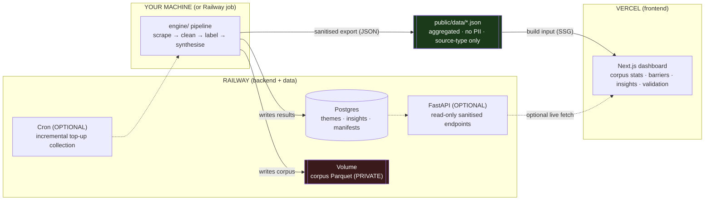

# Deployment Plan — AI-Powered Discovery Engine

**Project:** NextLeap Grad Project — Review Analyser
**Subject:** Blinkit (Indian quick commerce) — category exploration barriers
**Role:** Product Manager, Growth Team
**Date:** 27 July 2026
**Targets:** Railway (backend / pipeline / data) · Vercel (dashboard frontend)
**Status:** Deployment plan v1

> Companion docs: [PROBLEM_STATEMENT.md](PROBLEM_STATEMENT.md) · [ARCHITECTURE.md](ARCHITECTURE.md) ·
> [edge.md](edge.md) · [IMPLEMENTATION_PLAN.md](IMPLEMENTATION_PLAN.md).
> This document is the **how-to-ship**. It assumes the engine from `ARCHITECTURE.md` and inherits
> its privacy and no-fabrication rules verbatim.

---

## 0. Read this first — the one architectural truth that shapes everything

> **The review analyser is a batch data pipeline, not an always-on web service.** It scrapes for
> hours-to-days (rate-limited), labels for hours-to-days (free-tier LLM quota), and produces a set
> of **static deliverables** — corpus stats, themes, insights, validation numbers. Nothing about it
> is request/response.

That single fact decides the whole deployment:

- **The heavy work (scrape + label) does not belong on an always-on cloud service** — least of all a
  free tier that sleeps and meters. It runs as a **job**, not a **server**.
- **The output is presentational.** A dashboard that shows already-computed results is a perfect fit
  for Vercel — but it is showing *files*, not driving the pipeline.
- **Railway hosts the parts that must persist and run as jobs.** Vercel hosts the parts that must be
  *seen*.

Everything below follows from this. If you were expecting "deploy the pipeline as a live API and hit
it from the browser," §4 explains why that is the wrong shape and what to do instead.

---

## 1. What we deploy — and what we deliberately do not

| Component | Nature | Deploy target | Notes |
|---|---|---|---|
| **Pipeline engine** (`engine/`) | Batch job, multi-day, stateful | **Railway** (job) *or* local | See §4 — local is the honest default on free tier |
| **Results database** | Persistent, small, structured | **Railway Postgres** | Themes, insights, label metadata, run manifests |
| **Corpus store** (Parquet) | Large, **private UGC** | **Railway volume** or local — **never the frontend** | Third-party content we collect but do not own (§9) |
| **Sanitised export** (JSON) | Small, derived, safe | Build artifact → **Vercel** | The security boundary (§7) |
| **Dashboard** (Next.js) | Static presentational site | **Vercel** | Reads the sanitised export, not the corpus |
| **Read-only results API** (FastAPI) | *Optional* live layer | **Railway** | Only if you want interactive drill-down (§4, Model B) |

**Explicitly not deployed anywhere public:** the raw corpus, any verbatim with author provenance,
PII, the PII salt, API keys, or the labelling prompts containing the codebook. These stay private
by construction (§9).

---

## 2. Topology



Plain-text:

```
 [ engine pipeline ]  ──writes──▶  Railway Postgres (results)
   (local or Railway job)          Railway Volume  (corpus — PRIVATE, never shipped)
        │
        └── sanitised export ──▶  public/data/*.json  ──build──▶  Vercel dashboard
                                   (aggregated, no PII,            (static site)
                                    source-type attribution)
   optional: Railway FastAPI ─ live read-only ─▶ Vercel (only for interactive drill-down)
```

---

## 3. Repository shape (monorepo)

One repo, two deploy roots. Railway builds the Python service from the repo root; Vercel builds the
Next.js app from `dashboard/`.

```
NLreviewanalyser/
├── engine/                    # Python pipeline (Railway job / local)
├── config/                    # sources.yaml, models.yaml (no secrets)
├── dashboard/                 # Next.js app  ← Vercel root directory
│   ├── app/                   # routes: /, /barriers, /insights, /validation, /corpus
│   ├── public/data/           # sanitised JSON export (build input) — gitignored raw, see §7
│   └── package.json
├── deploy/
│   ├── railway.json           # Railway service config
│   ├── Dockerfile             # pipeline runtime (if containerised)
│   └── export.py              # the sanitisation step (§7) — the security boundary
├── .env.example               # names every secret, values empty
├── .gitignore                 # already excludes secrets + data/
└── DEPLOYMENT.md              # this file
```

**Vercel "Root Directory" setting = `dashboard/`.** This is the single most common misconfiguration
— without it, Vercel tries to build the Python repo and fails.

---

## 4. The batch-vs-service decision (read before provisioning anything)

The pipeline can be deployed two ways. Pick deliberately.

### Model A — Static-first (recommended, cheapest, safest)

```
run pipeline (local or Railway job) → results in Postgres
        → deploy/export.py produces sanitised JSON
        → JSON committed / uploaded as Vercel build input
        → Vercel rebuilds a fully static dashboard (SSG)
```

- **No live backend serving the browser.** The dashboard is a static build of already-computed,
  already-sanitised results. Nothing sensitive is reachable at runtime because nothing sensitive is
  *there* at runtime.
- **Fits the batch nature exactly:** new analysis → re-export → re-deploy. That is the real cadence
  of this project — you re-run the analysis occasionally, not per user request.
- **Railway's job here is minimal:** persist results, optionally run scheduled incremental
  collection. It does not need to stay awake to serve traffic.
- **This is the default. Choose it unless you have a concrete reason for Model B.**

### Model B — Live read-only API (only if you need interactive drill-down)

```
Railway FastAPI serves sanitised, read-only endpoints ← Postgres
        → Vercel dashboard fetches live (ISR or client-side)
```

- Add this **only** if the dashboard must filter/drill-down across the full result set interactively
  in ways a static export can't precompute.
- It introduces a live attack surface, CORS, and rate-limiting concerns (§9) that Model A simply does
  not have.
- Even here, the API serves **only the sanitised projection** — never the corpus, never PII.

### Where does the heavy pipeline actually run?

**Honest recommendation: run scrape + label locally, deploy only the results.** Reasons:

- Scraping is **multi-day and rate-limited**; LLM labelling is **multi-day on the free tier**
  (`IMPLEMENTATION_PLAN` T-P4-12, pause-until-quota-reset). Railway's free/trial tier meters usage
  and sleeps idle services — a 3-day job there burns the monthly credit and risks interruption.
- The pipeline already runs locally by design (`ARCHITECTURE` §3.1, local-first).
- Railway is far better used for the **persistent, serve-able** layer than as a long-job executor on
  a free plan.

Use a **Railway job** for the pipeline only when you specifically want a cloud run (e.g. to schedule
incremental top-ups) and accept the credit cost — trigger it with `railway run python -m engine...`
or a cron service, never as an always-on worker.

---

## 5. Railway setup

### 5.1 Provision

1. Create a Railway project from the GitHub repo (`GautamThakur1999/NLreviewanalyser`).
2. Add a **Postgres** plugin — Railway injects `DATABASE_URL` automatically.
3. Add a **Volume** mounted at `/data` for the corpus Parquet (private; see §9). Only needed if the
   pipeline runs on Railway; skip if it runs locally.
4. Service settings:
   - **Model A:** the service is a **job/cron**, not a web service — no public domain, no port.
   - **Model B:** a web service exposing the FastAPI port; Railway assigns a domain.

### 5.2 Runtime

Provide either a `Dockerfile` (`deploy/Dockerfile`) or rely on Railway's Nixpacks Python detection.
A Dockerfile is recommended for reproducibility (pins Python 3.12, matches the local env).

```dockerfile
# deploy/Dockerfile  (sketch — pin exact versions from pyproject.toml)
FROM python:3.12-slim
ENV PYTHONUTF8=1 PYTHONUNBUFFERED=1        # PYTHONUTF8 guards edge.md EC-X-02
WORKDIR /app
COPY pyproject.toml ./
RUN pip install --no-cache-dir -e .
COPY engine/ ./engine/
COPY config/ ./config/
COPY deploy/ ./deploy/
# Model A (job):  CMD ["python", "-m", "engine.cli", "--help"]   # invoked via railway run
# Model B (api):  CMD ["uvicorn", "engine.api:app", "--host", "0.0.0.0", "--port", "8000"]
```

### 5.3 Environment variables (Railway — the secret-bearing side)

Set in Railway's variables UI, **never committed**:

| Variable | Purpose |
|---|---|
| `GROQ_API_KEY` | LLM gate |
| `GEMINI_API_KEY` | LLM labelling / synthesis |
| `REDDIT_CLIENT_ID` / `REDDIT_CLIENT_SECRET` / `REDDIT_USER_AGENT` | Reddit connector |
| `YOUTUBE_API_KEY` | YouTube connector |
| `PII_SALT` | HMAC author hashing — **the crown jewel**, never rotated mid-project (EC-P-08) |
| `DATABASE_URL` | Injected by Railway Postgres |
| `COST_CEILING_USD` | Hard budget abort (T-P0-10) |
| `RUN_ENV` | `production` / `staging` |

> **These keys live ONLY on Railway (and your local `.env`). They must never reach Vercel or the
> browser.** The frontend never calls Groq or Gemini — it shows results the pipeline already
> produced.

### 5.4 Scheduled incremental collection (optional)

If you want the corpus to keep growing without manual runs, add a **Railway cron** service running
`python -m engine.collect --since <watermark>`. This exploits the incremental/watermark design
(T-P2-15) so each run only fetches new reviews. Keep the cadence modest — respect source rate limits
(§9) and the free-tier LLM quota downstream.

---

## 6. Vercel setup

### 6.1 Provision

1. Import the same GitHub repo into Vercel.
2. **Set Root Directory = `dashboard/`** (§3 — the #1 gotcha).
3. Framework preset: Next.js. Build command `next build`; output handled by Vercel.
4. Vercel auto-deploys on push to `main`, and creates **preview deployments** for every PR/branch.

### 6.2 Data source

- **Model A (static):** the sanitised JSON in `dashboard/public/data/` is read at build time (SSG).
  A new analysis → new export → push → Vercel rebuild. No runtime data fetching, no backend.
- **Model B (live):** set `NEXT_PUBLIC_API_URL` to the Railway API domain; fetch via ISR
  (`revalidate`) or client-side. CORS on the API must allow only the Vercel domain (§9).

### 6.3 Environment variables (Vercel — must be non-secret)

| Variable | Model | Note |
|---|---|---|
| `NEXT_PUBLIC_API_URL` | B only | The Railway API base URL. Public by design — it exposes only sanitised data. |
| *(none required for Model A)* | A | A static build needs no runtime secrets. |

> **No `GROQ_API_KEY`, `GEMINI_API_KEY`, or `PII_SALT` on Vercel — ever.** Anything prefixed
> `NEXT_PUBLIC_` is shipped to the browser; a secret there is a public secret. If you find yourself
> wanting an LLM key on Vercel, the architecture has gone wrong — the frontend never labels.

### 6.4 Dashboard surface (what the pages show)

Maps directly to the Part-1 deliverables (`ctx §9`):

| Route | Shows | Source deliverable |
|---|---|---|
| `/` | Run summary: corpus size, sources, date range, headline barrier ranking | Corpus doc + insight report |
| `/corpus` | Composition by source × brand × language × rating; filter/quarantine rates; declared gaps | Deliverable 2 |
| `/barriers` | Ranked, type-classified barriers with evidence counts and brand attribution | Deliverable 5 |
| `/insights` | The 8 research questions answered — claim · mechanism · segment · implication · confidence · bias | Deliverable 5 |
| `/validation` | κ, groundedness %, stability, saturation curve, coverage, triangulation, cross-provider, bias | Deliverable 4 |
| `/segments` | Explorer vs non-explorer characterisation | Deliverable 6 |

Exemplar quotes are shown **attributed by source-type only** ("a Play Store reviewer", "a Reddit
commenter") — never by author, never with a back-link that could re-identify (§9, rule 6).

---

## 7. The sanitisation boundary — `deploy/export.py`

**This is the most security-critical component in the whole deployment.** It is the one place where
internal data becomes public data, and it must be a deliberate, auditable transform — not a raw dump.

What it does:

1. **Reads** results from Postgres / the results files (themes, insights, validation, corpus stats).
2. **Aggregates** — counts, distributions, rankings. Never emits the raw corpus.
3. **Strips identity** — no `author_hash`, no `source_id`, no `url`, no `raw_payload_ref`. Exemplar
   quotes carry only a source-*type* label.
4. **Caps quotes** — a small number of short exemplar snippets per theme, drawn from `text_raw`,
   each already groundedness-verified (T-P6-03). No full documents.
5. **Enforces a schema** — the export has a fixed allow-list of fields; anything not on the list is
   dropped. A new internal field cannot leak by default.
6. **Runs a leak check** — asserts the output contains no PII pattern, no author hash, no URL, and no
   raw-corpus dump, before writing. Fails closed (mirrors the edge.md ethos).
7. **Writes** `dashboard/public/data/{summary,corpus,barriers,insights,validation,segments}.json`.

> **Guardrail:** the export is an **allow-list**, not a redact-list. Redact-lists leak the field you
> forgot to add; allow-lists leak nothing you didn't explicitly permit. Every field on the public
> surface is there because `export.py` named it.

---

## 8. CI/CD

| Trigger | Railway | Vercel |
|---|---|---|
| Push to `main` | Rebuild the service/job image | Rebuild + deploy the dashboard (production) |
| Open PR / branch | (optional staging service) | **Preview deployment** at a unique URL |
| New analysis run | manual: run pipeline → `export.py` → commit `public/data/*.json` → push | auto-rebuilds from the new JSON |

Both platforms watch the GitHub repo natively — no separate CI runner is required for basic
auto-deploy. Add a GitHub Action only if you want to run `pytest` (the guard tests, §12 of the impl
plan) as a merge gate before either platform builds. **Recommended:** gate merges on the test suite
so a change that weakens an S1 defence can't reach a deploy.

---

## 9. Security & privacy for deployment (non-negotiable)

This project's privacy posture (public repo, third-party UGC, PII, no author identification) makes
deployment higher-stakes than a typical app. These are hard rules.

| # | Rule | Why | Where enforced |
|---|---|---|---|
| SEC-1 | **Secrets only in platform env vars** (Railway) / local `.env` | Public repo — a committed key is instantly compromised (EC-X-10) | `.gitignore`, pre-commit scan, Railway/Vercel var stores |
| SEC-2 | **No LLM keys or PII salt on Vercel** | The frontend never labels; a browser-side key is public | §6.3 — Vercel vars are non-secret only |
| SEC-3 | **The raw corpus never reaches the frontend** | It is UGC we collect but do not own and must not redistribute (ARCH §18) | `export.py` allow-list (§7); corpus stays on Railway volume / local |
| SEC-4 | **No PII in any deployed surface** | PII is stripped at ingestion (T-P2-08); the deploy must not reintroduce it | `export.py` leak check; PII stripped before storage anyway |
| SEC-5 | **Quotes attributed by source-type only** | Rule 6 + no re-identification (§18) | `export.py`; dashboard rendering |
| SEC-6 | **No personal details of the author anywhere** | Standing rule 6 | Dashboard has no author/owner field; role only |
| SEC-7 | **Model B API is read-only + CORS-locked to the Vercel domain** | A live endpoint is an attack surface | FastAPI: no write routes, CORS allow-list, rate limit |
| SEC-8 | **No PII or secrets in build logs** | Logs on both platforms are retained | Log redaction (ST-12); never `print` a key |
| SEC-9 | **Export runs a fail-closed leak check before publishing** | Last line of defence before data goes public | `export.py` step 6 |

> **The single question that governs every deploy decision:** *does this put raw corpus, PII, an
> author identity, or a secret onto a public surface?* If yes, it does not ship — regardless of
> convenience.

---

## 10. Free-tier reality (honest constraints)

You are on free tiers of Groq/Gemini; Railway and Vercel free tiers have their own limits. Plan for
them rather than discover them.

| Platform | Free-tier limit that matters here | Consequence | Mitigation |
|---|---|---|---|
| **Railway** | Trial/hobby usage credit; services sleep when idle | A multi-day pipeline job burns credit and can be interrupted | Run the heavy pipeline **locally** (§4); use Railway for persistence + light cron only |
| **Railway** | Volume size cap | Large corpus may not fit | Keep corpus local; store only *results* (small) on Railway |
| **Vercel** | Build minutes; static bandwidth | A static dashboard is well within limits | Model A (SSG) keeps you comfortably inside the free tier |
| **Vercel** | Serverless function execution cap (10s hobby) | Long work in a route would time out | The dashboard does **no** long work — it renders precomputed results |
| **Groq/Gemini** | Daily token + request caps | Labelling spans days | Already handled by the pipeline (T-P4-12), not by the deploy |

**Takeaway:** the free-tier-friendly deployment is **Model A + local pipeline execution**. Railway
holds results and optional cron; Vercel serves a static dashboard. Nothing long-running lives on a
metered free service.

---

## 11. Deployment phases (ordered)

Mirrors the impl-plan style: each phase has an objective and an exit gate.

| Phase | Objective | Exit gate |
|---|---|---|
| **D0 — Prep** | Monorepo shape; `dashboard/` scaffold; decide Model A vs B; define the export schema | `dashboard/` builds empty; export schema (allow-list) written |
| **D1 — Sanitisation layer** | Build `deploy/export.py` + its fail-closed leak check **first** | Export produces safe JSON from a sample results set; leak check blocks a planted PII string |
| **D2 — Railway backend** | Provision project, Postgres, (volume), env vars/secrets | A pipeline run writes results to Postgres; `engine.verify` passes with cloud secrets |
| **D3 — Vercel frontend** | Scaffold the six dashboard routes reading the export | Static build renders real results; Root Directory = `dashboard/` |
| **D4 — CI/CD** | GitHub → auto-deploy both; PR previews; test gate | A push deploys both; the guard-test suite gates merges |
| **D5 — Hardening** | SEC-1…9 verified; (Model B: CORS + rate limit); secret-scan clean | The §9 checklist fully ticked; no secret/corpus/PII on any public surface |
| **D6 — Go-live** | Publish; run the go-live checklist (§13) | Dashboard live; runbook (§12) validated |

> **D1 before D2/D3 is deliberate.** Build the security boundary before there is anything to expose.
> The same reason the validation harness is a first-class stage, not a final review.

---

## 12. Operational runbook

**To publish a new analysis:**
1. Run the pipeline (local): `python -m engine.cli` through to reports.
2. `python deploy/export.py --run-id <RUN>` → writes `dashboard/public/data/*.json` and runs the
   leak check (fails closed on any PII/identity/corpus leak).
3. Review the export diff — confirm no unexpected field appeared.
4. Commit `dashboard/public/data/*.json` and push. Vercel rebuilds automatically.
5. Verify the live dashboard against the run's validation numbers.

**To rotate a compromised key:**
1. Revoke at the provider (Groq/Gemini/Reddit).
2. Update the Railway variable (and local `.env`).
3. **Do not rotate `PII_SALT`** — it would break `author_hash` comparability across runs (EC-P-08).
   Treat the salt as write-once for the project's life.

**If a deploy is interrupted mid-run:** the pipeline is resumable (T-P4-12); the dashboard is
static and unaffected — it keeps showing the last published results until a new export lands.

---

## 13. Go-live checklist

- [ ] `.gitignore` excludes `.env`, `data/`, and `dashboard/public/data/` raw inputs; repo scan clean
- [ ] All secrets set in Railway; **none** on Vercel; none in the repo
- [ ] `export.py` allow-list reviewed; leak check passes and fails closed on a planted PII string
- [ ] No raw corpus, `author_hash`, `url`, or `source_id` present in any `public/data/*.json`
- [ ] Exemplar quotes attributed by source-type only; no author, no back-link
- [ ] No personal details of the author on any page (rule 6)
- [ ] Vercel Root Directory = `dashboard/`; static build succeeds
- [ ] Model B only: API is read-only, CORS locked to the Vercel domain, rate-limited
- [ ] Build logs contain no secrets (redaction verified)
- [ ] Dashboard numbers reconcile with the run's validation report
- [ ] Guard-test suite gates merges in CI

---

## 14. Open decisions

| # | Decision | Options | Leaning |
|---|---|---|---|
| 1 | Static (A) or live API (B)? | A = cheapest/safest; B = interactive | **A** — the results are batch-computed; interactivity can be precomputed |
| 2 | Pipeline execution home | Local / Railway job / Railway cron | **Local** for the heavy run; Railway cron only for incremental top-ups |
| 3 | Results store | Postgres / Parquet-on-volume / static JSON only | Postgres if Model B; **static JSON only** is viable for Model A |
| 4 | Corpus at rest | Railway volume / local only | **Local only** on free tier — keeps the private UGC off a metered service |
| 5 | Dashboard framework | Next.js / plain static | **Next.js** (Vercel-native, SSG, easy charts) |

---

## 15. Summary

- **Railway = the backend and the data** (results DB, private corpus volume, optional cron and
  optional read-only API). It runs *jobs*, not a permanent server, on the free tier.
- **Vercel = the dashboard** — a static Next.js site (Model A) that renders the sanitised export.
  It never holds a secret and never sees the corpus.
- **The pipeline itself runs locally** on the free tier, because a multi-day scrape+label job does
  not belong on a metered, sleeping cloud service.
- **`deploy/export.py` is the security boundary** — an allow-list transform with a fail-closed leak
  check that converts private results into a safe public projection.
- **The governing rule:** nothing that could put raw corpus, PII, an author identity, or a secret on
  a public surface ever ships — the same discipline the rest of the project runs on.

---

*End of deployment plan.*
